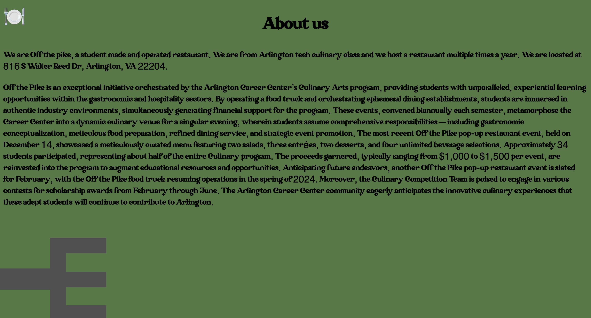
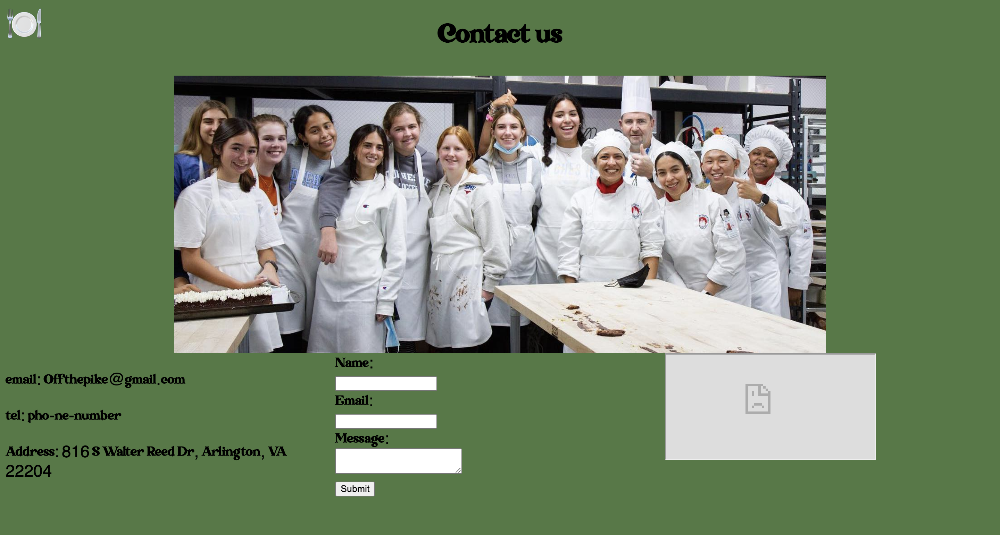

## Off The Pike project

Partners: Udval, Angel

[Project](https://alexhamill.github.io/reservation/index.html)
[Repo](https://github.com/alexhamill/reservation)

I worked on the contact us and the about us pages. My for was a way to submit comments about the restaurant on the contact us page incase someone didn't want to have to get the email and email. I used the correct input types for all of the inputs eg. Email and Phone to cut back on bad input. I also made the message required but left the name and email boxes not required in case someone wanted to submit an anonymous claim. I found that working with others was more of a struggle than a help for a project of this size. Working with other people is important on bigger projects but i feel like this was just six pages and could have been made by one person and it could have looked more cohesive. Im not saying that because i think that my pages are better than my partners, They are not Udvals look so good, I just think sharing all the ideas was difficult. We did encounter a few merge issues at the beginning but as we went we got better at it and had no more problems.

